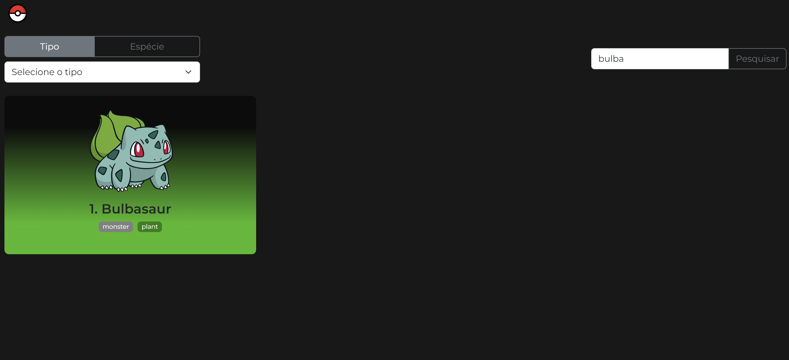
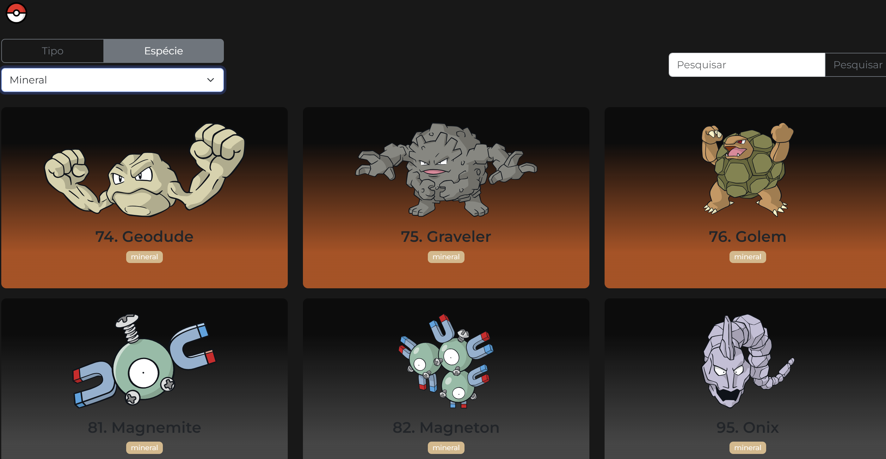

# Pokedex

Projeto desenvolvido para teste técnico. Neste projeto, podemos ver uma Pokedex, com os dados extraidos da API PokeAPI, com todos os Pokemons, com scroll infinito ,de todas as gerações, também é possível filtrá-los por nome, numero da pokedex, tipo e espécie.

## Tecnologias Utilizadas

* Vue 
* Vuex
* Swiper
* Vite 
* Bootstrap
* Vercel

## Como utilizar a aplicação

Ao entrar no aplicativo, você consegue ver a lista de pokemons existentes, ao scrollar para baixo, ele carrega mais dados dos próximos pokemons.


### Filtro

Ao digitar o nome do pokemon desejado e clicando em Pesquisar, a lista atualiza com os pokemons que derem match com sua pesquisa.



Ao selecionar o tipo, você recebe a lista de pokemons do tipo selecionado.


Ao selecionar a espécie, ele traz na lista os resultados dos pokemons daquela espécie.



## Acessar o projeto online

O projeto está rodando no servidor do Vercel. Você pode acessá-lo no link: 

[Pokedex](https://pokedex-nine-kohl.vercel.app/)

## Como clonar o projeto e rodar localmente

### Pré requisitos

* Node
* NPM

### Clonar o projeto

```
git clone https://github.com/ferbortoloto/Pokedex.git
```

### Instalar as dependências

Entre na pasta do projeto e execute o comando

```
npm i
```

### Rodar o projeto

```
npm run dev
```
